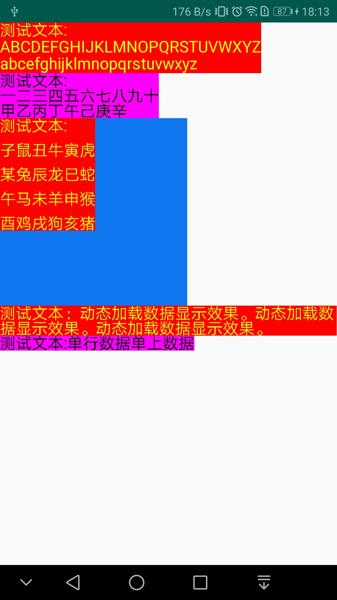

# NoBroderTextView
* <font size ="5" face="微软雅黑">实现Android自定义TextView控件去除内边距</font>

   > <font size = "4" face="微软雅黑">控件名称：NoPaddingTextView</font><br/>
     <br/>
     <font color="#dd0000" size = "5" face="微软雅黑">注意:控件NoPaddingTextView不支持动态声明</font>
## 效果图
<br/>

## 静态属性
```xml
    android:lineSpacingExtra="设置行间距（默认为0.0f）"
    android:lineSpacingMultiplier="行间距基数（默认为1.0f）"
```